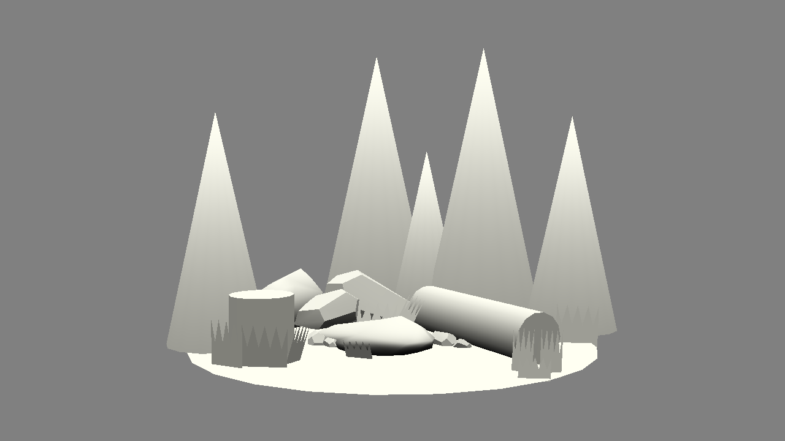

# AnimalsNotIncluded

Author: Joyce Zhang

Design: A little "repeat after me" rhythm piano game. 
There were supposed to be cute birds bobbling along -- I ran out time :(
Screen Shot:

How To Play:
WASD corresponds to four different sounds! Repeat after notes the lead finishes! 
There's three rounds of the game, after that it's just a music player
if it's too hard, references the console print outs! 

This game was built with [NEST](NEST.md).
